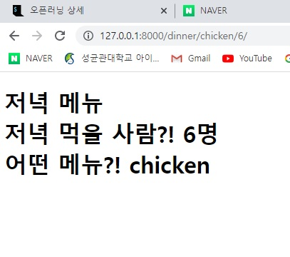

1.into/urls.py

```django
from django.contrib import admin
from django.urls import path
from pages import views

urlpatterns = [
    path('admin/', admin.site.urls),
    path('dinner/<str:food>/<int:person>/', views.dinner)
]

```


2. pages/views.py

```django
def dinner(request, food, person):
    context = {
        'food' : food,
        'person' : person
    }
    return render(request, 'dinner.html', context)
```

3. templates/dinner.html

```html
<!DOCTYPE html>
<html lang="en">
<head>
    <meta charset="UTF-8">
    <meta http-equiv="X-UA-Compatible" content="IE=edge">
    <meta name="viewport" content="width=device-width, initial-scale=1.0">
    <title>Document</title>
</head>
<body>
    <h1>저녁 메뉴
        <br>
        저녁 먹을 사람?! {{ person }}명
        <br>
        어떤 메뉴?! {{ food }}
    </h1>
</body>
</html>
```


