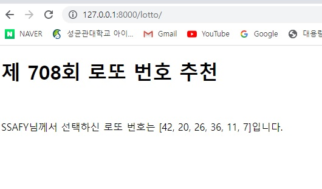

1. intro/urls.py

```django
from django.contrib import admin
from django.urls import path
from pages import views

urlpatterns = [
    path('admin/', admin.site.urls),
    path('lotto/', views.lotto)
]

```

2. pages/views.py

```django
from random import Random, random
from django.shortcuts import render
import random
# Create your views here.
def lotto(request):
    
    pick = random.sample(range(1,46),6)
    numbers = random.sample(range(1,1001),1)
    for i in numbers:
        number = int(i)
    context = {
        'pick' : pick,
        'number': number,
    }

    return render(request, 'lotto.html',context)
```

3. templates/lotto.html

```django
<!DOCTYPE html>
<html lang="en">
<head>
    <meta charset="UTF-8">
    <meta http-equiv="X-UA-Compatible" content="IE=edge">
    <meta name="viewport" content="width=device-width, initial-scale=1.0">
    <title>Document</title>
</head>
<body>
    <h1>제 {{ number }}회 로또 번호 추천 </h1>
    <br>
    <p>SSAFY님께서 선택하신 로또 번호는 {{ pick }}입니다.</p>
</body>
</html>
```

