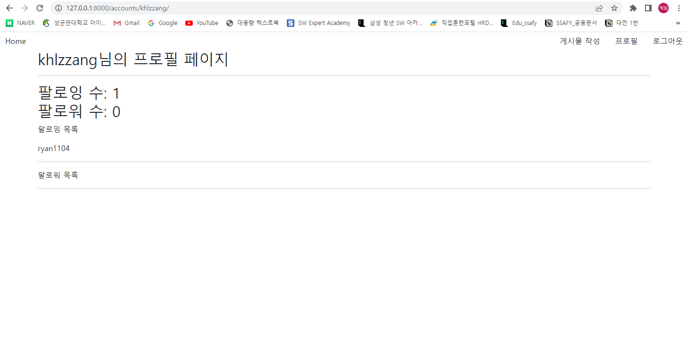

## 결과



```python
#accounts/views.py
from django.shortcuts import render, redirect, get_object_or_404
from django.contrib.auth.forms import AuthenticationForm
from django.contrib.auth import login as auth_login
from django.contrib.auth import logout as auth_logout
from django.contrib.auth import get_user_model


from .forms import (
    CustomUserCreationForm,
)


# 회원가입
def signup(request):
    if request.method == 'POST':
        form = CustomUserCreationForm(request.POST)
        if form.is_valid():
            form.save()
            return redirect('accounts:signup')
    else:
        form = CustomUserCreationForm()

    context = {
        'form': form
    }
    return render(request, 'accounts/signup.html', context)


# 로그인
def login(request):
    if request.method == 'POST':
        form = AuthenticationForm(request, request.POST)
        if form.is_valid():
            user = form.get_user()
            auth_login(request, user)
            return redirect('accounts:profile', user.username)
    else:
        form = AuthenticationForm()
    context = {
        'form': form
    }
    return render(request, 'accounts/login.html', context)


# 로그아웃
def logout(request):
    auth_logout(request)
    return redirect('accounts:login')


# 프로필
def profile(request, username):
    person = get_object_or_404(get_user_model(), username=username)
    context = {
        'person': person
    }
    return render(request, 'accounts/profile.html', context)


def follow(request, pk):
    if not request.user.is_authenticated:
        return redirect('accounts:login')
    
    person = get_object_or_404(get_user_model(), pk=pk)
    if person != request.user:
        if person.followers.filter(pk=request.user.pk).exists():
            person.followers.remove(request.user)
        else:
            person.followers.add(request.user)
    
    
    return redirect('accounts:profile', person.username)
```

```python
# accounts/models.py
from django.db import models
from django.contrib.auth.models import AbstractUser


class User(AbstractUser):   
    followings = models.ManyToManyField('self', symmetrical=False, related_name='followers')

```

```django
 profile.html 



<h2>
  {{ person.username }}님의 프로필 페이지
  <hr>
  팔로잉 수: {{ person.followings.all|length }}
  <br>
  팔로워 수: {{ person.followers.all|length }}
</h2>


<form action="" method="POST">
  
  
  <button class="btn btn-outline-primary">팔로우 취소</button>
  
  <button class="btn btn-primary">팔로우</button>
  
</form>



<p>팔로잉 목록</p>

  {{ following.username }}
  <hr>



<p>팔로워 목록</p>

  {{ follower.username }}
  <hr>



<hr>

{{ article }}



```

