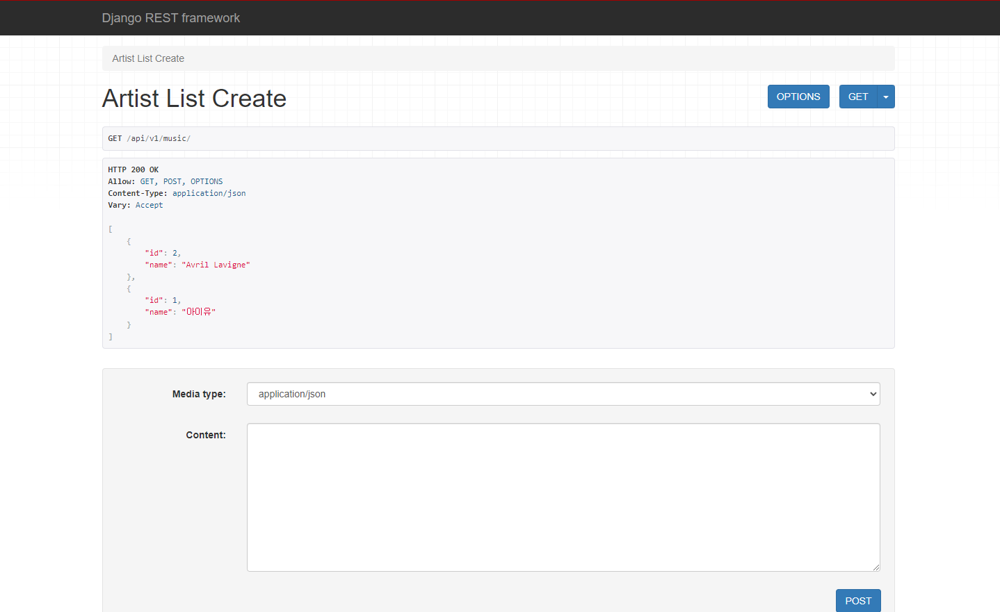
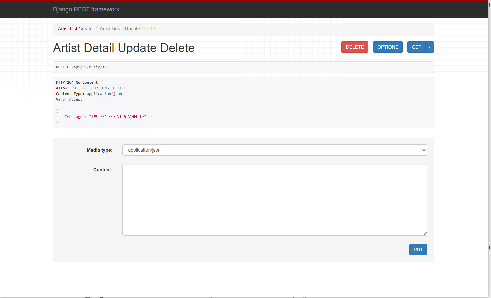
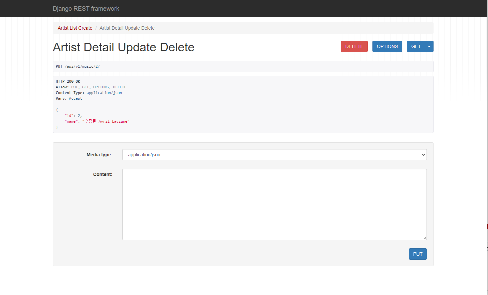
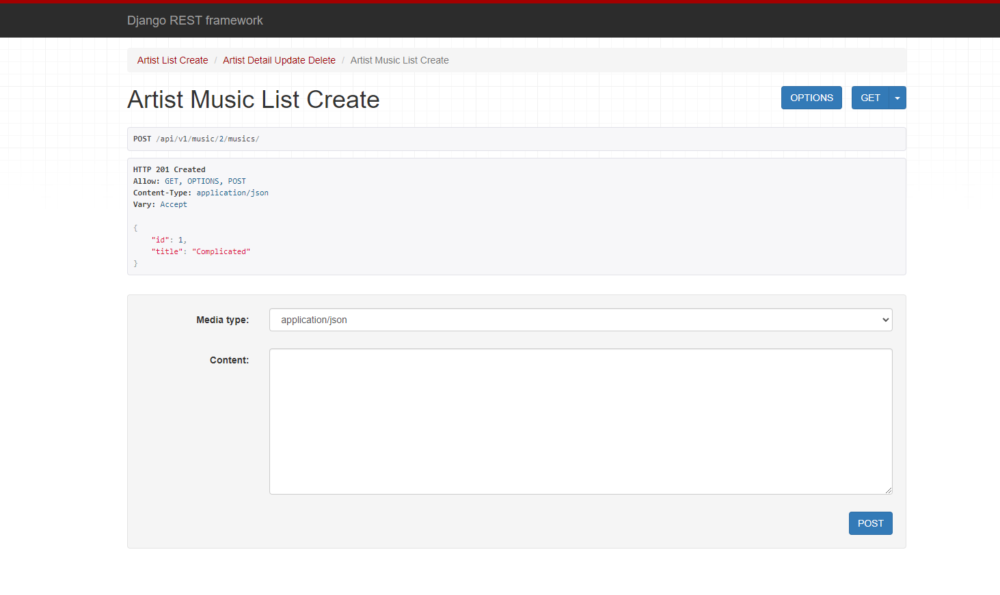
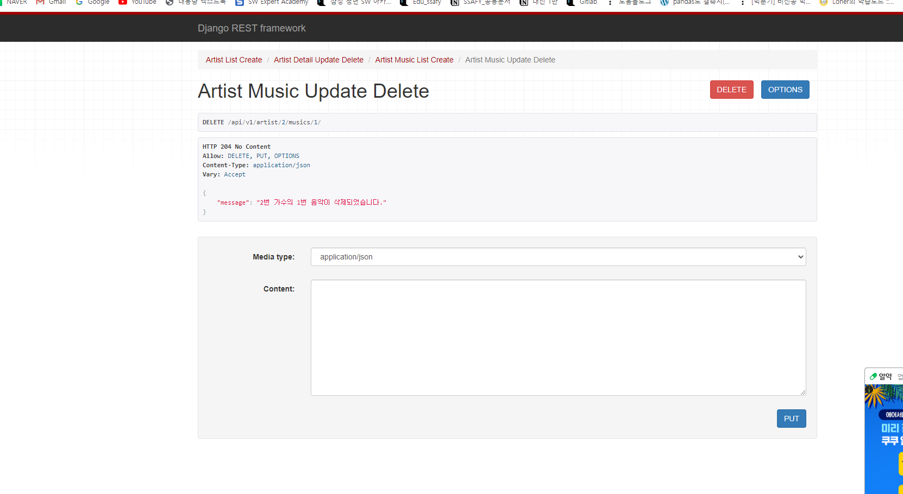

```python
from rest_framework import serializers
from .models import Artist, Music


class ArtistListSerializer(serializers.ModelSerializer):
    
    class Meta:
        model = Artist
        fields = '__all__'


class ArtistCreateSerializer(serializers.ModelSerializer):

    class Meta:
        model = Artist
        fields = '__all__'


class MusicListSerializer(serializers.ModelSerializer):

    class Meta:
        model = Music
        fields = '__all__'

class ArtistDetailSerializer(serializers.ModelSerializer):
    # read_only = validation 과정에서 제외
    comment_set = MusicListSerializer(many = True, read_only = True)
    class Meta:
        model = Artist
        fields = '__all__'

class MusicCreateSerializer(serializers.ModelSerializer):

    class Meta:
        model = Music
        exclude = ('artist',)

#views.py
from django.shortcuts import get_list_or_404, get_object_or_404, render
from rest_framework.decorators import api_view
from rest_framework.response import Response
from rest_framework.status import (
    HTTP_201_CREATED,
    HTTP_400_BAD_REQUEST,
    HTTP_204_NO_CONTENT,
)
from .models import Artist, Music
from .serializers import (
    ArtistListSerializer,
    ArtistCreateSerializer,
    ArtistDetailSerializer,
    MusicListSerializer,
    MusicCreateSerializer,
)
from music import serializers
# Create your views here.

@api_view(['GET', 'POST'])
def artist_list_create(request):
    if request.method == 'GET':
        artists = Artist.objects.order_by('-pk')
        

        # 변환 = 직렬화  serializer로 변환
        serializer = ArtistListSerializer(artists, many = True )        

        # Response 안에는 json이나 딕셔너리형태로 들어가야함 
        return Response(serializer.data)
    elif request.method == 'POST':
        # creation => serializer 
        serializer = ArtistCreateSerializer(data= request.data )
        # 문제 발생하면 알려주기 
        if serializer.is_valid(raise_exception= True):
            serializer.save()
            # 넘겨준 정보가 잘 저장이 되었다!
            return Response(serializer.data, HTTP_201_CREATED)
        return Response({'message': '잘못된 요청입니다.'},HTTP_400_BAD_REQUEST)

@api_view(['GET', 'PUT', 'DELETE'])
def artist_detail_update_delete(request, pk):
    artist = get_object_or_404(Artist, pk = pk)
    if request.method == 'GET':
        serializer = ArtistDetailSerializer(artist)
        return Response(serializer.data)
    elif request.method == 'PUT':
        serializer = ArtistDetailSerializer(artist, request.data)
        if serializer.is_valid(raise_exception= True):
            serializer.save()
            return Response(serializer.data)
    elif request.method == 'DELETE':
        artist.delete()
        return Response({'message': f'{pk}번 가수가 삭제 되었습니다'}, HTTP_204_NO_CONTENT)

@api_view(['GET', 'POST'])
def artist_music_list_create(request, pk):
    artist = get_object_or_404(Artist, pk = pk)
    if request.method == 'GET':
        musics = artist.music_set.order_by('-pk')
        # get_list_or_404()
        serializer = MusicListSerializer(musics, many = True)
        return Response(serializer.data)
    if request.method == 'POST':
        request.data
        serializer = MusicCreateSerializer(data= request.data)
        if serializer.is_valid(raise_exception= True):            
            serializer.save( artist = artist)
            return Response(serializer.data, HTTP_201_CREATED)

@api_view(['PUT', 'DELETE'])
def artist_music_update_delete(request, artist_pk, pk):
    artist = get_object_or_404(Artist, pk = artist_pk)
    music = get_object_or_404(artist.music_set, pk = pk)
    if request.method == 'PUT':
        serializer = MusicCreateSerializer(music, request.data)
        if serializer.is_valid(raise_exception= True):
            serializer.save()
            return Response(serializer.data)
    elif request.method == 'DELETE':
        music.delete()
        return Response({'message': f'{artist_pk}번 가수의 {pk}번 음악이 삭제되었습니다.'}, HTTP_204_NO_CONTENT)
```










